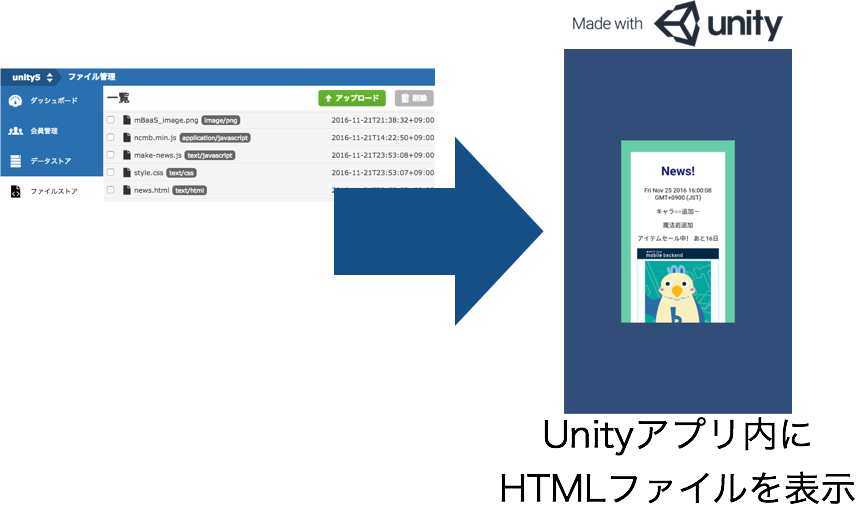
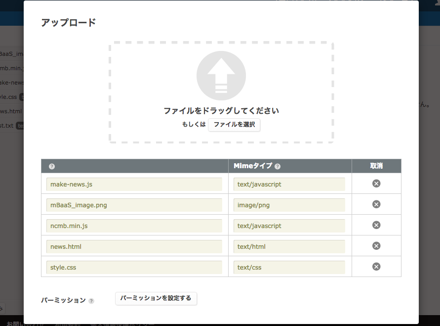
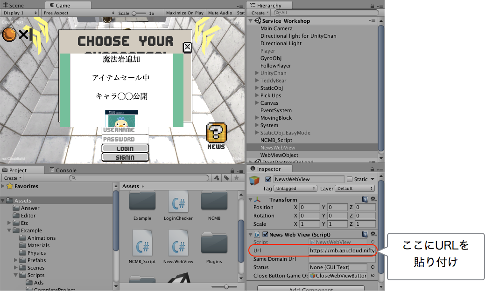
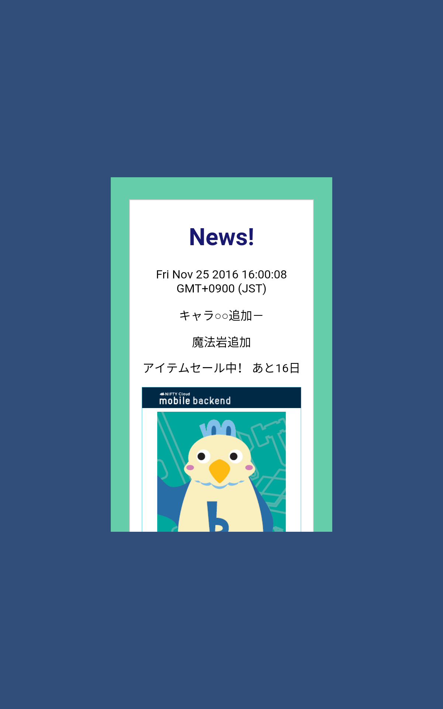

# アプリデベロッパーズアカデミー　〜クラウドサービス篇　全部できるまで帰しま10〜


## 概要
* アプリデベロッパーズアカデミー　〜クラウドサービス篇　全部できるまで帰しま10〜での[ニフティクラウドmobile backend](http://mb.cloud.nifty.com/)の問題「アプリ内にお知らせ機能を作りましょう」の正解サンプルです。


## ニフティクラウドmobile backendって何？？
スマートフォンアプリのバックエンド機能（プッシュ通知・データストア・会員管理・ファイルストア・SNS連携・位置情報検索・スクリプト）が**開発不要**、しかも基本**無料**(注1)で使えるクラウドサービス！今回はデータストアを体験します

注1：詳しくは[こちら](http://mb.cloud.nifty.com/price.htm)をご覧ください


## 動作環境
* Mac OS X 10.10.5(Yosemite)
* Unity ver. 5.5.0
* MonoDevelop-Unity ver. 5.9.6
* NCMB UnitySDK v2.2.0

※上記内容で動作確認をしています。

## 手順
### 流れ
1. [ニフティクラウドmobile backend](http://mb.cloud.nifty.com/)の会員登録とログイン→アプリ作成
2. mobile backendにファイルストアにデータをアップロードし、公開ファイル設定を行う
3. HTMLファイルの公開URLをUnityのWebViewアプリに設定
4. Editorで表示orアプリをビルドする

### 1. [ニフティクラウドmobile backend](http://mb.cloud.nifty.com/)の会員登録とログイン→アプリ作成

* 上記リンクから会員登録（無料）をします。登録ができたらログインをすると下図のように「アプリの新規作成」画面が出るのでアプリを作成します


* アプリ作成されると下図のような画面になります
* この２種類のAPIキー（アプリケーションキーとクライアントキー）はXcodeで作成するiOSアプリに[ニフティクラウドmobile backend](http://mb.cloud.nifty.com/)を紐付けるために使用します


* 動作確認後に会員情報が保存される場所も確認しておきましょう


### 2. mobile backendにファイルストアにデータをアップロードし、公開ファイル設定を行う

[お知らせ機能のサンプルプコード：UnityNewsWebViewプロジェクト](https://github.com/hounenhounen/UnityNewsWebView)をDLし,Fileフォルダないのファイルを全てニフティクラウドmobile backendのファイルストアにアップロードします。アップロードする際は下記の画面が表示されます。その後、公開ファイル設定を行ってください。




公開ファイル設定は[このブログ](http://qiita.com/natsumo/items/6edd296dd871f80c466a#4-ファイルの公開ファイルurlを取得と確認)を参考にしてください。

### 3. HTMLファイルの公開URLをUnityのWebViewに設定



### 4. Editorで表示orアプリをビルドする
* Unity上で真ん中の実行ボタン（さんかくの再生マーク）をクリックもしくは、ビルドをすると下記のような画面が表示されます。
(Unity5.5×WindowsではEditor上でWebviewがひらけないため動作を確認できませんが、その場合はAndroidビルドをお願いいたします。)





## 解説
サンプルコードに実装済みの内容のご紹介

### HTMLファイルの内容

今回のHTML（news.html）では下記のように同時にファイルストアにアップロードした各種のファイルを読み込んでいます。

読み込んでいるファイル
* style.css ・・・デザインを構築するCSSファイルです。
* ncmb.min.js ・・・ニフティクラウド mobile backendのJSSDKです。
* make-news.js ・・・SDKを元にHTMLを構築するスクリプトです。

make-news.jsが<div id="content">内にHTMLを構築します。

```html
<html>
<head>
	<meta charset="UTF-8">
	<link rel="stylesheet" type="text/css" href="./style.css" media="all">
	<script type="text/javascript" src="./ncmb.min.js"></script>
	<script type="text/javascript" src="./make-news.js"></script>
</head>
<body>
    <h1>News!</h1>
		<p>魔法岩追加</p>
		<p>アイテムセール中</p>
		<p>キャラ◯◯公開</p>
</body>
</html>
```

### make-news.jsのロジック

make-news.jsで行っていることは主に以下の3つです。

1. DOMの読み込みが終了するまで、HTMLの構築を停止するロジック
2. ファイルストアから画像を引き出し、表示

#### 1. DOMの読み込みが終了するまで、HTMLの構築を停止するロジック

今回は__`function DocumentReadyStateInteractiveFunc(e)`__に掲示する情報のHTMLを構築するロジックが書かれています。その作動タイミングを下記のメソッドで制御しています。なお作動のタイミングは__`news.html`__の読み込みが完了するまでに設定してあります。

```js
// Wait construct DOM
if (document.addEventListener) {
    document.addEventListener("DOMContentLoaded", DocumentReadyStateInteractiveFunc);
}
```

#### 2. ファイルストアから画像を引き出し、表示

表示している画像もファイルストアから、引き出しています。もちろん、__``__で画像は表示できるのですが紹介もかねて、SDKからDLして表示するコードを書いています。

下記のコードではblob型でDLした画像をDataURL化し画像表示を行っています。

```js
ncmb.File.download("mBaaS_image.png",'blob')
    .then(function(fileData){
        var img = document.createElement('img');
        var reader = new FileReader();
        news_element.appendChild(img);
        blobToDataURL(fileData,function(dataurl){
            img.src = dataurl;
        });

    })
    .catch(function(err){
        console.log(err);
    })

```
